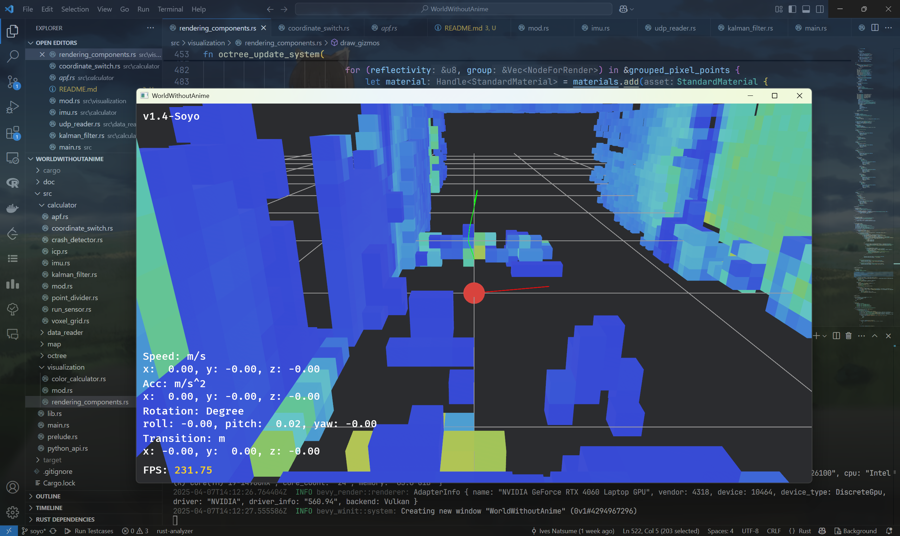

# WorldWithoutAnime

基于Livox MID360激光雷达开发的无人机自主导航和避障软件。使用Rust开发，并由Bevy引擎进行可视化渲染。

编写时截止至1f9b9cf，v1.4-Soyo

## 主要数据结构

### LaserPoint

代表单个点云，存储其三维坐标和反射率信息

### LaserData

代表相同时间戳下读取的同一个点云数据包，包含时间戳，CRC校验码等。

### Octree

在`src/octree`模块中自行实现了基础的不可扩展八叉树，后续增加扩展功能。

### ImuIntegrator

存储惯导数据的模块，包含六轴IMU数据和累积IMU读数

## 主要方法

### IMU计算

通过`imu_init()`进行零偏校准，后续读取数据时使用卡尔曼滤波。根据合加速度进行零速检测和匀速运动检测。

### APF路径规划

通过建立人工势场引导无人机进行避障。